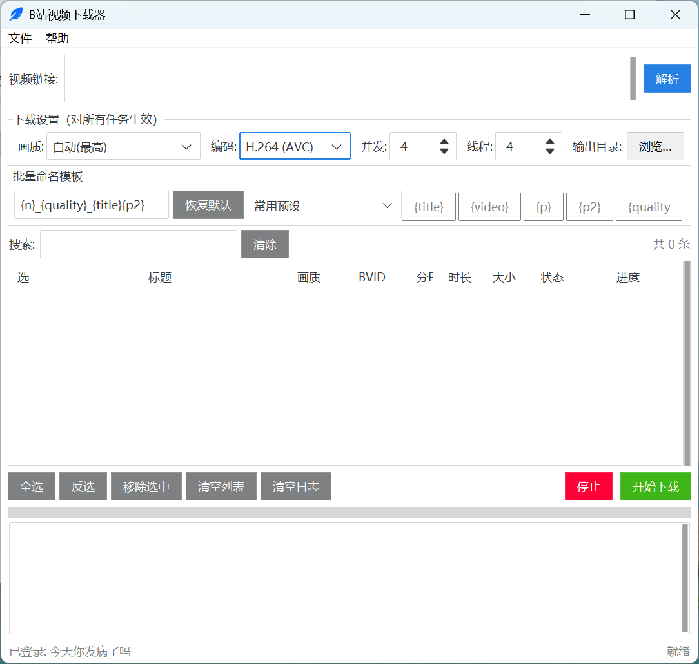
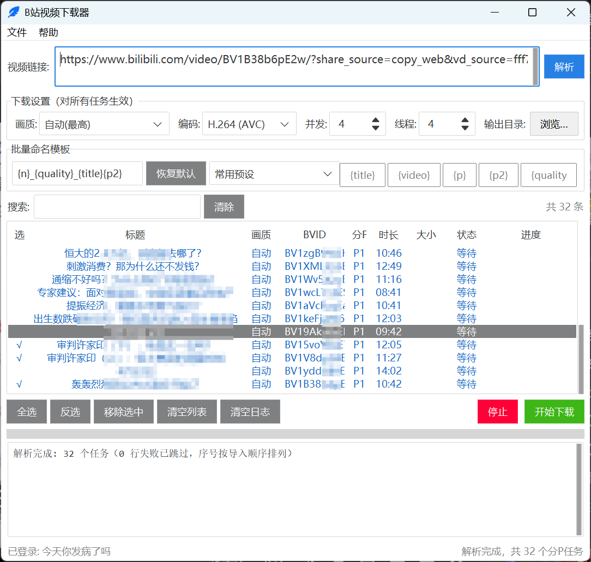

# BiliDownloader

B站视频下载 GUI 工具，支持视频、合集、系列、收藏夹、多P分集、批量链接导入，可选画质/编码，自动重命名。

> **免责声明**：本工具仅供个人学习、备份与离线观看。请遵守哔哩哔哩用户协议及相关法律法规，下载内容的版权责任由使用者自行承担。

---

## 功能特性

- 支持单个视频、多P分集、合集（ugc_season）、系列、收藏夹
- 支持批量粘贴多个链接，坏行自动跳过
- 可选画质（240P ~ 4K/8K）和编码（AVC / HEVC / AV1）
- 可调并发数（1-8 任务）和单任务分片线程（1-16）
- 自定义文件命名模板，支持多种变量组合
- 任务级画质覆盖（双击任务行单独设置）
- 内置 ffmpeg，高画质音视频自动合并



---

## 快速开始

### 方式一：下载打包版（推荐）

1. 从 [Releases](https://github.com/PixelByteW/bilidownloader/releases) 下载 `BiliDownloader.exe`
2. 双击运行，首次启动会弹出免责声明，勾选同意后继续

### 方式二：源码运行

```bash
# 克隆仓库
git clone https://github.com/PixelByteW/bilidownloader.git
cd bilidownloader

# 安装依赖
pip install -r requirements.txt

# 启动
python main.py
```

---

## 使用方法

### 1. 获取 Cookie（下载高画质/收藏夹必需）

1. 浏览器打开 [bilibili.com](https://www.bilibili.com) 并登录
2. 按 `F12` 打开开发者工具 → 切换到 **网络(Network)** 标签
3. 刷新页面，点击任意请求 → **请求头(Request Headers)** → 找到 `Cookie` 字段
4. 复制整段 Cookie 值
5. 在软件中点击菜单 **文件 → 导入 Cookie**，粘贴保存

> 不导入 Cookie 也能下载公开视频，但只能获取最低画质。

### 2. 解析链接

- 在顶部输入框粘贴链接，**每行一个**，支持批量
- 按 `Ctrl + Enter` 或点击 **解析** 按钮
- 支持的链接格式：
  - 视频：`bilibili.com/video/BVxxxxxx`
  - 合集/剧集：`bilibili.com/list/BVxxxxxx`
  - 收藏夹：`space.bilibili.com/xxx/favlist?fid=xxx`
  - 系列：`space.bilibili.com/xxx/lists/xxx?type=series`
  - 任意包含 BV 号的 URL

### 3. 下载

- 解析后在列表中勾选要下载的任务（默认全选）
- 设置画质、编码、并发数等参数
- 点击 **开始下载**，进度实时显示

<!-- 截图占位：下载过程截图 -->


### 4. 命名模板

使用变量自定义文件名格式，默认为 `{quality}_{title}{p2}`。

| 变量 | 说明 | 示例 |
|---|---|---|
| `{title}` | 分P标题 | `第1集` |
| `{video}` | 主标题 | `某剧名` |
| `{p}` | 分P序号 | `1` |
| `{p2}` | 分P序号（单P为空） | `_01` |
| `{quality}` | 画质 | `1080P` |
| `{codec}` | 编码 | `hevc` |
| `{bvid}` | BV号 | `BV1xx411c7mD` |
| `{n}` | 导入顺序号 | `001` |

示例：`{video}_{n:03d}_{quality}` → `某剧名_001_1080P.mp4`

---

## 命令行模式

```bash
python main.py --cli <URL> [输出目录] [画质qn] [编码]
```

参数说明：
- `URL`：B站视频链接
- `输出目录`：可选，默认当前目录
- `画质qn`：可选，画质代码（16=360P, 32=480P, 64=720P, 80=1080P, 116=1080P60, 120=4K）
- `编码`：可选，`avc` / `hevc` / `av1` / `auto`

---

## 打包为 exe

需要 Python 3.10+，Windows 系统。

```bash
# 1. 下载 ffmpeg 静态构建，放入 ffmpeg/ 目录
#    下载地址：https://github.com/BtbN/FFmpeg-Builds/releases

# 2. 安装打包工具
pip install pyinstaller

# 3. 执行打包
python -m PyInstaller --noconfirm --clean BiliDownloader.spec

# 输出位于 dist/BiliDownloader.exe
```

或直接运行 `build.bat` 一键打包。

---

## 项目结构

```
├── main.py                # 入口（GUI / --cli 命令行）
├── app/
│   ├── ui.py              # 界面（ttkbootstrap）
│   ├── bili_api.py        # B站接口封装（解析/视频信息/画质探测）
│   ├── downloader.py      # yt-dlp 下载（并发/重试/合并）
│   ├── models.py          # Task 数据模型
│   └── config.py          # 配置读写
├── ffmpeg/ffmpeg.exe      # 音视频合并（打包内嵌）
├── BiliDownloader.spec    # PyInstaller 配置
├── build.bat              # 一键打包脚本
├── app.ico                # 图标
├── requirements.txt       # Python 依赖
├── LICENSE                # MIT License
└── README.md
```

---

## 技术栈

- **Python 3.10+**
- **yt-dlp** — 视频解析与下载
- **curl_cffi** — yt-dlp 下载器后端（绕过部分限制）
- **ttkbootstrap** — 现代化 Tkinter 主题
- **ffmpeg** — 音视频合并（DASH 分离流）

---

## 注意事项

1. **Cookie 有效期**：B站 Cookie 会过期，下载失败提示"未登录"时需重新导入
2. **ffmpeg**：下载 1080P 及以上画质时需要 ffmpeg 合并音视频，程序自带 ffmpeg，也可自行放置
3. **网络问题**：国内部分 IP 可能被 B 站限流，遇到下载失败可稍后重试
4. **版权**：请仅下载你有权访问的内容，勿用于商业用途或传播
5. **配置文件**：打包版配置存储在 exe 同目录 `config.json`，源码版在 `%APPDATA%\BiliDownloader\config.json`

---

## 开源协议

[MIT License](LICENSE) — 自由使用、修改、分发，作者不对使用本软件产生的任何后果负责。
